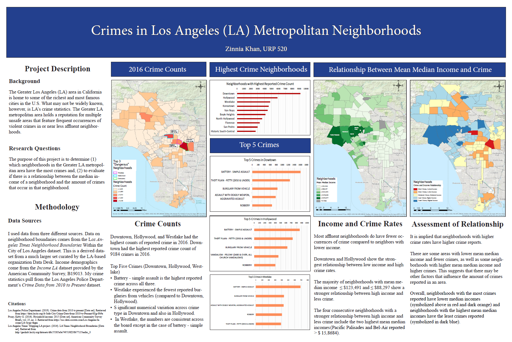

# 2019LACrimes_Mapping

[GDB Download](https://drive.google.com/drive/folders/1l4CNidwuRbI-VJBvLhykFPkBXLMMBaI0?usp=sharing)

[Poster PDF](https://github.com/zinniak/2019LACrimes_Mapping/blob/master/images/Poster.pdf)

## PROJECT OVERVIEW

The Los Angeles (LA) area in California is home to some of the richest and most famous cities in the U.S. Famous cities include Malibu, Hollywood and Beverly Hills as well as well-known beautiful beaches and wealthy shopping areas. However, the LA metropolitan area also holds a reputation for multiple unsafe neighborhoods that feature frequent occurrences of violent crimes in or near less affluent neighborhoods.

The purpose of this project is to determine (1) which neighborhoods in the LA metropolitan area have the most crimes and, (2) to evaluate if there is a relationship between the mean median income of a neighborhood and the amount of crimes that occur in that neighborhood. I also identify and measure the five most frequent types of crimes in the top three neighborhoods with the highest number of crimes.

The three most dangerous neighborhoods in the LA metropolitan area are Downtown, Hollywood, and Westlake. By visualizing median household income and crime in each neighborhood, I have also found that more affluent neighborhoods do have fewer occurrences of crime compared to neighbors with lower income. Therefore, my results demonstrate that there is a relationship between median income and the frequency of crimes.

## METHODOLOGY

### Data Integration

1. **Standalone Table:** *LA_crimes_20162.csv*

Key Fields:

- ***LAT:*** Numeric Data, Double Field
- ***LON:*** Numeric Data, Double Field
- ***AREA NAME:*** Nominal Data, Text Field
- ***Crm Cd Desc:*** Categorical Data, Text Field

This data set is a cleaned and filtered version of the Crime data from 2010 to present dataset sourced from lacity.org. To reduce the size of the data, I used python to extract crimes that were reported in 2016, the most recent year I found income data for. I was also more interested in crimes that a usual resident or tourist like myself could be a victim of such as violent crimes. Therefore, my final version of the crime dataset includes crimes such as robbery, burglary, homicide, and vehicle theft.

2. **Standalone Table:** *LA_median_income_2016.csv*

Key Fields:

- ***Lat:*** Numeric Data, Double Field
- ***Long:*** Numeric Data, Double Field
- ***Amount:*** Numeric Data, Double Field
- ***Tract Number:*** Categorical Data, Long Integer Field
- ***Neighborhood:*** Nominal Data, Text Field

This dataset is a cleaned version of the median household income by neighborhood data sourced from USC. I used python to extract the latitude and longitude values into separate columns to allow for coordinate plotting in ArcGIS Pro.

3. ***Standalone Table:*** *Corr_Categories.csv*

Key Fields:

- ***Neighborhood:*** Nominal Data, Text Field
- ***Correlation_Category:*** Categorical Data, Long Integer Field

This dataset that I have processed myself assigns a crime frequency category and a mean median income category from 1-10 to each neighborhood in the main polygon feature layer created and used in this project.

4. ***Polygon Feature Class:*** *LA_Times_Neighborhood_Boundaries*

Key Fields:

- ***Name:*** Nominal Data, Text Field

## Integration Tools (ArcGIS)

Below is an outline of the ArcGIS tools and their paramater inputs and outputs used to create the database and maps.

1. **XY Table To Point:** in the Data Management toolbox in the Features toolset

| Parameter Name     | Input | Data Type |
| ----------- | ----------- | ----------- |
| Input Table     | LA_crimes_20162.csv       | Table View |
| X Field   | LON       | Double Integer Field |
| Y Field | LAT | Double Integer Field |
| Coordinate System | GCS_WGS_1984 | Spatial Reference |

2. **Summary Statistics:** in the Analysis toolbox in the Statistics toolset

| Parameter Name     | Input | Data Type |
| ----------- | ----------- | ----------- |
| Input Table     | LA_median_income_2016.csv       | Standalone Table|
| Output Table   | LA_mean_median_income_per_tract      | Standalone Table |
| Statistics | Field: Amount, Statistics Type: Mean | Value Table |
| Case Field | Neighborhood | Text Field |

3. **Add Join:** in the Data Management toolbox in the Joins and Relates toolset

| Parameter Name     | Input | Data Type |
| ----------- | ----------- | ----------- |
| Layer Name or Table View    | LA_Times_Neighborhood_Boundaries     | Polygon Feature Layer |
| Input Join Field   | name    | Text Field |
| Join Table| LA_mean_median_income_per_tract | Standalone Table |
| Join Type (Optional)| KEEP_COMMON| Boolean |

4. **Spatial Join:** in the Analysis toolbox in the Overlay toolset

| Parameter Name     | Input | Data Type |
| ----------- | ----------- | ----------- |
| Target Features   | LA_Times_Neighborhood_Boundaries     | Polygon Feature Layer |
| Join Features   | LA_crimes_2016    | Point Feature Layer |
| Output Feature Class | LA_neighborhoods_crimes_and_income | Polygon Feature Layer |
| Join Operation | Join One to Many | String |
| Match Option | Intersect | String |

5. **Summary Statistics:** in the Analysis toolbox in the Statistics toolset

| Parameter Name     | Input | Data Type |
| ----------- | ----------- | ----------- |
| Input Table   | LA_neighborhoods_crimes_and_income    | Polygon Feature Layer |
| Output Table   | Neighborhood_crime_count   | Standalone Table |
| Statistics | Field: DATE OCC, Statistics Type: Count | Value Table |
| Case Field| Neighborhood | Text Field|

6. **Add Join:** in the Data Management toolbox in the Joins and Relates toolset

| Parameter Name     | Input | Data Type |
| ----------- | ----------- | ----------- |
| Layer Name or Table View   | LA_neighborhoods_crimes_and_income    | Polygon Feature Layer |
| Input Join Field  | Neighborhood   | Text Field |
| Join Table | Neighborhood_crime_count | Standalone Table |
| Output Join Field | Neighborhood | Text Field|

7. **Add Join:** in the Data Management toolbox in the Joins and Relates toolset

| Parameter Name     | Input | Data Type |
| ----------- | ----------- | ----------- |
| Layer Name or Table View   | LA_neighborhoods_crimes_and_income    | Polygon Feature Layer |
| Input Join Field  | Neighborhood   | Text Field |
| Join Table | Corr_Categories.csv | Standalone Table |
| Output Join Field | Neighborhood | Text Field|

## ASSESSMENT

I was able to find out which neighborhoods in Los Angeles Metropolitan have the highest crime counts in 2016 as well as what the top three most common crimes were in these neighborhoods.

In regards to finding a relationship between mean median income and crime frequency, symbolizing neighborhoods based on their mean median income and crime frequency shows that most high-income neighborhoods do have fewer crimes than neighborhoods with lower median incomes.

There are some areas with lower mean median income and fewer crimes, as well as some neighborhoods with higher mean median income and higher crimes. This suggests that there may be other factors that influence the amount of crimes reported in an area. It can be argued that many of the higher income neighborhoods are larger and are less populous than neighborhoods with lower incomes which could be reasons why they have fewer crimes. Overall, however, neighborhoods with the most crimes reported have lower median incomes and neighborhoods with the highest mean median incomes have the least crimes reported, showing that there is some relationship between crime and mean median income.

## DATA SOURCES

- Los Angeles Police Department. (2019). Crime data from 2010 to present [Data set]. Retrieved
from https://data.lacity.org/A-Safe-City/Crime-Data-from-2010-to-Present/63jg-8b9z 
- Posey, Kirby G. (2016). Household income: 2015 [Data set]. American Community Survey Briefs, vol. 25, no. 2. Retrieved from
https://usc.data.socrata.com/Los-Angeles/Income-LA-/kygc-fzgm 
- Los Angeles Times' Mapping LA project. (2016). LA Times Neighborhood Boundaries [Data set]. Retrieved from http://geohub.lacity.org/datasets/d6c55385a0e749519f238b77135eafac_0

